**SENG 637- Dependability and Reliability of Software Systems**

**Lab. Report \#5 – Software Reliability Assessment**

| Group: 16           |
|-------------------------------|
| Sayan                     |   
| Md Afif Al               |   
| Sutirtha                   |   
| Abhijit              |
| Moshfiq-Us-Saleheen  |

# Table of Contents
- [Introduction](#1-introduction)
- [Assessment using Reliability Growth Testing (RDC)](#2-assessment-using-reliability-growth-testing) 
    - [Model selection and comparison](#21-model-selection-and-comparison)
    - [Laplace range analysis](#22-laplace-range-analysis)
    - [Running average of failures over time](#23-running-average-of-failures-over-time)
    - [Plots for failure rate and reliabililty of the SUT for the test data](#24-plots-for-failure-rate-and-reliability-of-the-sut-for-the-test-data)
    - [Discussion on decision making given a target failure rate](#25-discussion-on-decision-making-given-a-target-failure-rate)
    - [Advantages and disadvantages of reliability growth analysis](#26-advantages-and-disadvantages-of-reliability-growth-analysis)
- [Assessment using Reliability Demonstration Chart (RDC)](#3-assessment-using-reliability-demonstration-chart)
    - [Dataset preparation](#31-dataset-preparation)
    - [RDC plots on test data](#32-rdc-plots-on-test-data)
    - [Finding MFFTmin and justification of the approach](#33-finding-mttfmin-and-justification-of-the-approach)
    - [Finding 2 $\times$ MTTFmin and 1/2 $\times$ MTTFmin](#34-finding-2-mttfmin-and-12-mttfmin)
    - [Advantages and disadvantages of reliability demonstration chart](#35-advantages-and-disadvantages-of-reliability-demonstration-chart)
- [Comparison of results](#4-comparison-of-results)
- [Discussion on similarity and differences of the two techniques](#5-discussion-on-similarity-and-differences-of-the-two-techniques)
- [Division of team effort](#6-division-of-team-effort)
- [Difficulties encountered, challenges overcome, and lessons learned](#7-difficulties-encountered-challenges-overcome-and-lessons-learned)
- [Comments/feedback](#8-commentsfeedback)

# 1 Introduction
In this assignment, we explore different aspects of Reliability Growth Testing (RGT) and Reliability Demonstration Chart (RDC) for the assessment of software reliability. We have been provided a failure dataset and a few tools to work with. We will explore those tools and report the results of our findings throughout the report. Before we further dive into the assignment, we provide a quick overview of both type of testing.

#### Reliability Growth Testing (RGT)
RGT involves iterative testing aimed at predicting and improving the reliability of software systems over time. It relies on analyzing failure data and using mathematical models to forecast future reliability performance. The primary goal of RGT is to identify reliability issues early in the development process, thereby enhancing the overall reliability of the software.

#### Reliability Demonstration Chart (RDC)
RDC, on the other hand, focuses on determining the acceptability of a software system based on predefined risk thresholds. It involves statistical analysis of reliability data to construct graphical representations, enabling stakeholders to make informed decisions regarding the reliability of the software.

# 2 Assessment Using Reliability Growth Testing 
### 2.1 Model selection and comparison 
In this assignment, we used C-SFRAT, SFRAT tools along with Python for reliability growth testing. We also explored str.core on Docker to assess its capability. Our approach to use this tool is followed by a few steps:
1. Run C-SFRAT.
2. Load the provided failure data.
3. Run estimation for all the available model and covariate combinations. C-SFRAT provides the following hazard functions or models.
    - IFR Salvia & Bollinger
    - IFR genralized Salvia & Bollinger
    - S Distribution
    - Discrete Weibull (Order 2, Type III)
    - Geometric
    - Negative Binomial (Order 2)
    - Truncated Logistic

    The covariates are E, F, C, and a combination of (E, F), (E, C), (F, C), and (E, F, C)
4. Compare the model results by different metrics like Akaike Information Criterion (AIC), Bayesian Information Criterion (BIC), etc.
5. Choose the top 2 best performing models for further analysis.

The initial outcome after running all the models and covariate combinations look like below:
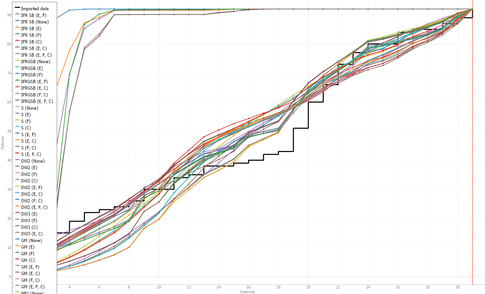
For comparison of the models, we simply sort by the different metric columns provided by the C-SFRAT tool. As defined in our comparison approach above, we choose the best models based on their AIC and BIC values. Both of these metrics are statistical measures used for model selection. 

**AIC**: AIC is a measure of the relative quality of a statistical model for a given set of data. It takes into account both the goodness of fit of the model and the complexity of the model (number of parameters). The lower the AIC value, the better the model is considered to be. In this report, the best AIC score of 122.199 is attained by the Discrete Weibull (Type III) model with covariate (F) and followed by a score of 125.323 gained by the Geometric model with covariate (F).

**BIC**: BIC is similar to AIC but penalizes model complexity more strongly. It tends to select simpler models than AIC when there is a trade-off between goodness of fit and model complexity. Similar to AIC, lower BIC values indicate better-fitting models. In this report, the best BIC score of 127.935 is attained by the Discrete Weibull (Type III) model with covariate (F) and followed by a score of 129.625 gained by the Geometric model with covariate (F).

We report the top 2 models and covariate combinations in the following table. The full results can be found in the [model_results.csv](results/model_results.csv) file.

| Model Name | Covariates | Log-Likelihood | AIC | BIC | SSE | PSSE | Critic (Mean) | Critic (Median) |
|------------|------------|----------------|-----|-----|-----|------|----------------|-----------------|
| **DW3**        | F              | -57.09962860281749 | 122.19925720563498 | 127.93520602357556 | 528.0457018475142 | 16.021015042563807 | 1.0 | 1.0 |
| **GM**         | F              | -59.66172245742845 | 125.3234449148569 | 129.62540652831234 | 759.6549462658442 | 87.9032532380169 | 0.9987877941564863 | 0.999286826565977 |

### 2.2 Laplace range analysis
We applied laplace test analysis to find out the most effective subset for prediction. We utilized both SFRAT tool and wrote our own python [script](scripts/laplace.py) for the analysis. The result is in the following figure:
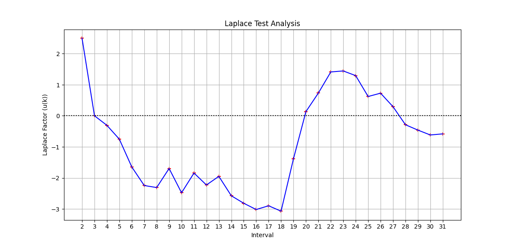 After excluding the first failure, it is evident from the figure that reliability improves from 2nd to 18th interval and then again decreases from 19th to 23rd interval. Generally, a laplace factor ranging between -2 <= _u(k)_ <= 2 indicates stable reliability. Hence, we choose, a range of 0 to 21 to provide our models sufficient data points to get a better insight on the failure data. It turns out using the subset of first 21 data points out of all with the covariate F as 20 efforts per interval yields a very good performance compared to the other combination. One possible reason could be the sharp increase of the number of failures (increased by almost 10) on 20th interval followed by a similar large step in the 19th interval. This essentially means, if we leave out this points from our subset, the model is missing an important pattern while including these two intervals provide a better insights of the data to the models. The plots provided in the following section a better demonstration of this drastic change in the number of failures.

### 2.3 Running average of failures over time
We also investigate the running average of failure of the SUT by using SFRAT. It is a calculation to analyze data points by creating a series of averages of different selections of the full data set. It helps to smooth out sudden fluctuations in time-series data and provides a better insights on the trend. Typically, if the trend is upwards then the errors or failures are rising and if it is downwards, number of failures is decreasing.
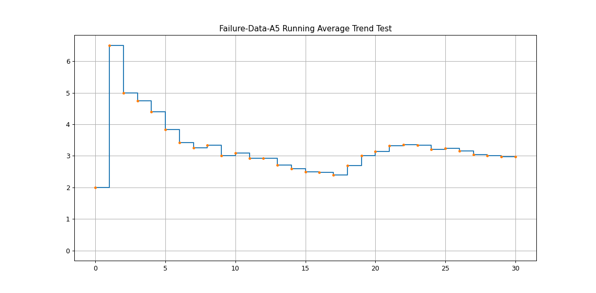
### 2.4 Plots for failure rate and reliability of the SUT for the test data
For a better comparison, we show both predictions using a subset of all data and predictions using only first 21 data. The interval to failure plot of the two selected models is provided below:
Figure A: Interval to failure plot using all data.
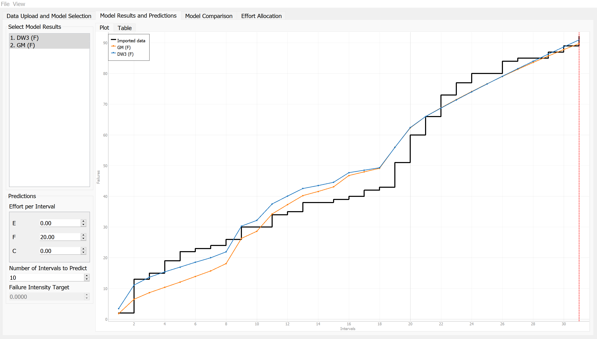
Figure B: Interval to failure plot using subset of 21
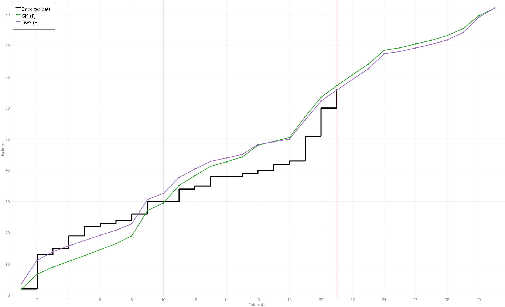

Now we report the failure intensity predictions using all data and using the subset of first 21 data points.

Figure A: Failure intensity plot using all data.
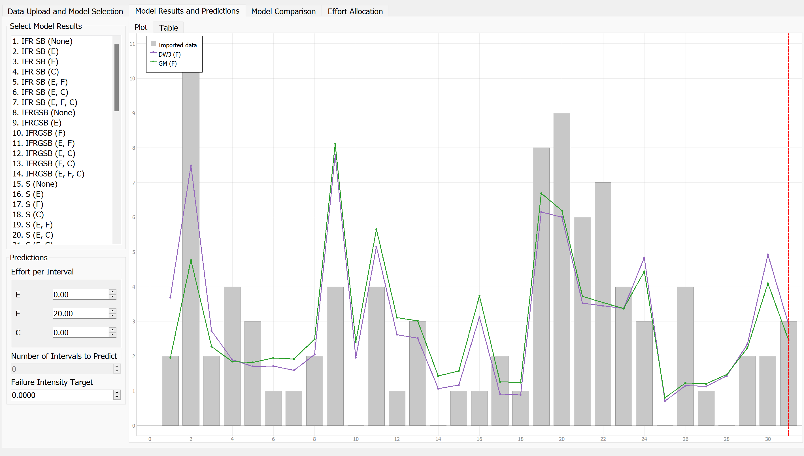
Figure B: Failure intensity plot using subset of 21
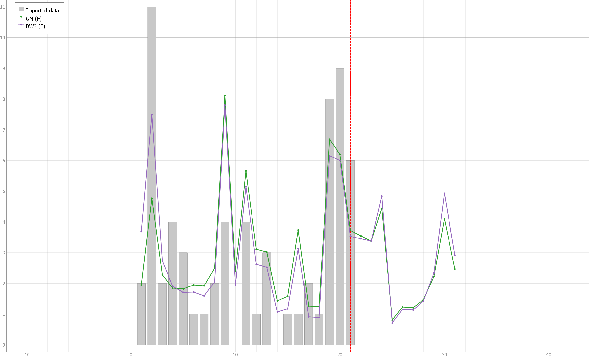

The plots provide us an important insights about our original data amd the prediction of the models.

We get the cumulative failure for both DW3 and GM from this table by summing the respective columns.
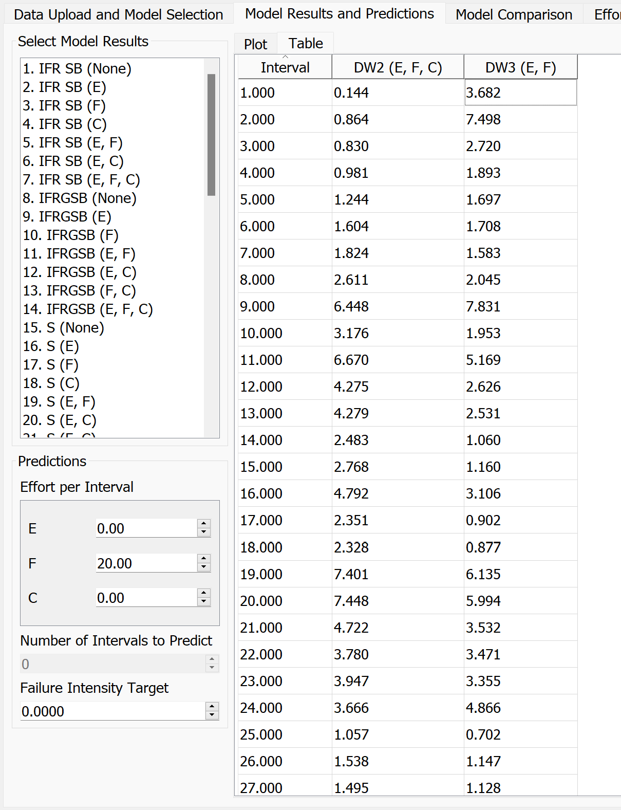

On the 31st interval the cumulative failure for the predictios are:

**DW3 = 91**

**GM = 90**

We calculate the failure rate and mean time to failure (MTTF) for both the original data and the predications in the following table:

| Data         | Failure Rate (Failure/Interval) | MTTF (intervals) |
|-----------------|---------------------------|------------------|
| Provided data      | 92/31 = 2.967              | 1/2.96 = 0.338   |
| DW3 (F) Prediction  | 91/31 = 2.935              | 1/2.94 = 0.340   |
| GM (F) Prediction   | 90/31 = 2.903              | 1/2.90 = 0.345   |

The table provides the results of our models compared to the provided failure data. It seems that by using the subset of first 21 data to predict the next 10 intervals (up to 31st interval), the failure rate and MTTF is almost similar to the original failure data.

### 2.5 Discussion on decision making given a target failure rate
Based on the results from the previous table, we can use this information to make decisions given a target failure rate. Typically, the concerned software companies/businesses will have their acceptable target failure rate or MTTF.

Let's consider 2 examples with different failure rates.

**Example with an Acceptable Failure Rate of 2:**
If the business considers an acceptable failure rate to be 2 Failures/Interval, then at the 31st interval, this system would be unacceptable because the raw data shows 2.96 failures per interval.

**Example with an Acceptable Failure Rate of 3:**
If the business sets an acceptable failure rate at 3 Failures/Interval, then the system would be acceptable at the 31st interval based on raw data (2.96 failures per interval). However, using the DW or GM model, we can estimate when the failure rate might exceed 3 in the future.

### 2.6 Advantages and disadvantages of reliability growth analysis
**Advantages**

1. **Predictive capability:** Reliability Growth Testing (RGT) allows users to predict the failure behavior using a set of predefined models. This predictive capability enables proactive identification and mitigation of potential reliability issues.

2. **Model comparison:** By utilizing Akaike Information Criterion (AIC) and Bayesian Information Criterion (BIC), it becomes easy to compare which models best fit the data. This facilitates informed decision-making regarding model selection and optimization.

3. **Reduces downtime:** Increased reliability means fewer system failures, resulting in reduced downtime for users and businesses, which can be critical in large-scale systems or businesses.

**Disadvantages**

1. **Dependency on data subset:** Predictions generated by RGT are dependent on the subset of data (or ranges) used for the prediction. If the subset contains distortions or outliers, the predictions may not accurately reflect the system's true reliability behavior.

2. **Dependency on model selection:** The accuracy of predictions is heavily dependent on the model used. If the selected model is not appropriate for the data or fails to capture the underlying reliability patterns, the predictions may lack accuracy and reliability. Therefore, careful consideration and validation of the chosen model are crucial for obtaining meaningful results from RGT.

3. **False sense of security:** Relying solely on reliability growth testing may give a false sense of security, as it cannot guarantee that all reliability issues have been addressed, and unforeseen failures may still occur in real-world usage.

# 3 Assessment Using Reliability Demonstration Chart 
We utilized the RDC-11 spreadsheet to demonstrate Reliablity Demonstration Chart. However, the spreadsheet only accepts failures per interval. Hence, we modified the provided failure data uniformly in each interval to use it with the spreadsheet. Additionally, the spreadsheet only supports 16 data points. Hence, we had to look for a modified version of the RDC spreadsheet that could accommodate all the 92 data points that we get after preparing our failure dataset.

### 3.1 Dataset preparation
Let's assume we have $FC = 2$ on $T = 1$. Hence, we distribute intervals uniformly by converting it to:

|Cumulative Failure Count|Time Between Failure|Cumulative Time|
|---|---|---|
|1|0.5|0.5|
|2|0.5|1.0|

The logic is implemented in this Python [script](scripts/RDC.py) and the new generated dataset can be found [here](failure-data-a5/failure-data-rdc.csv).
The updated RDC spreadsheet is also [linked here.](Assignment-5-artifacts/RDC-11/RDC-updated.xlsx)

In the following table, we show the first 5 and last 3 rows from the table to provide a better understanding of our generated data:
| Cumulative Failure Count | Time Between Failure | Cumulative Time |
|--------------------------|----------------------|-----------------|
| 1                        | 0.5000               | 0.5000          |
| 2                        | 0.5000               | 1.0000          |
| 3                        | 0.0909               | 1.0909          |
| 4                        | 0.0909               | 1.1818          |
| 5                        | 0.0909               | 1.2727          |
|...                       |...                   |...              |
|90                        |0.3333                |26.3333          |
91|0.3333|26.6667|
92|0.3333|27.0000|

### 3.2 RDC plots on test data

To generate the RDC we use the default risk parameters:
|Risk Parameter|Value|
|---|---|
|Discrimination Ratio ($\gamma$)| 2|
|Developer's Risk ($\alpha$)|0.1|
|User's Risk ($\beta$)|0.1|

In this section, we first start with exploring the RDC spreadsheet with the default MTTF that we have in our failure data and then proceed to the assignment requirements including finding the minimum MTTF and experimenting with the double and half of its value.

**Default MTTF:** We first plot the RDC graph using the calculated MTTF of the SUT to familiraize ourselves with the plotting system. Here, we have:

$FIO = 92 failures/31 intervals = 2.97$ and $MTTF = 1/FIO = 1/2.97 = 0.337$

It turns out, with this setup, the system immediately goes into the reject region.
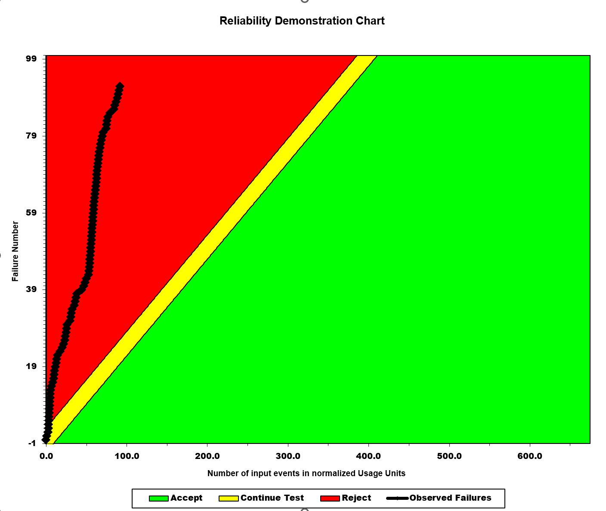

### 3.3 Finding MTTFmin and justification of the approach 
In this setup, we first attempt to find the MTTFmin where the system is deemed to be acceptable. We find this by brute-force approach of changing the FIO until it becomes barely acceptable. The approach involves increasing or decreasing the number of failures on time intervals.  By this, we mean that the system may probably touch the reject line but will never enter the reject region. Our approach was time consuming to experiment with different values and observing the outcomes. However, it turned out to be quite fruitful as the minimum MTTF we found for our system effectively determines the minimum value to consider our system acceptable. The values evaluated are discussed in the following sections.

**MTTFmin:** We find the MTTFmin when $FIO = 670 failurs/31 intervals = 21.613$ and $MTTF = 1/21.613 = 0.046$. Similar behaviour of the RDC chart was observed when the failure rates were between 670 - 675.
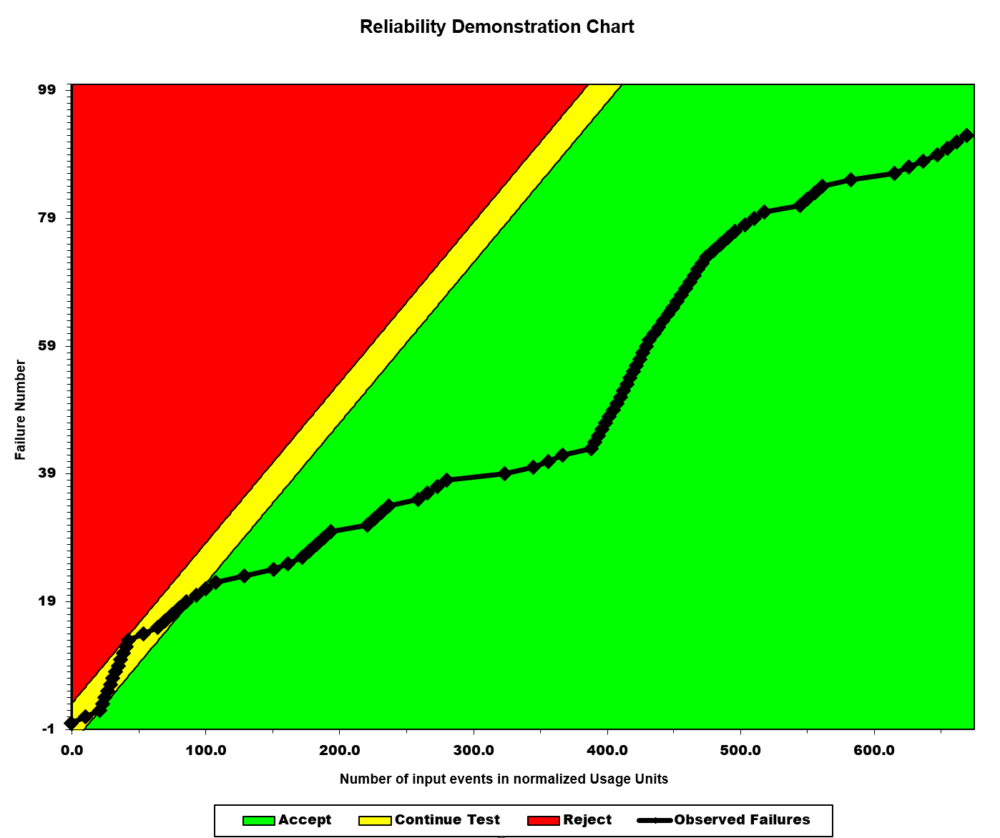

### 3.4 Finding 2 $\times$ MTTFmin and 1/2 $\times$ MTTFmin
**2 $\times$ MTTFmin:** After finding the MTTFmin, as per the requirements of this assignment, we double the value of MTTF and experiment with it. Doubling the MTTF implies that the software system or component is expected to operate reliably for a longer period before encountering a failure. We double the MTTF to $0.046 \times 2 = 0.092$, yielding $FIO = 1/0.092 = 10.87$. Normalizing this into fractions, give us 1087 failures per 100 intervals, or similarly around 337 failures in 31 intervals. We plot this on the RDC chart. In this setup, the system goes to the reject region quite fast and fluctuates between accept and reject region.

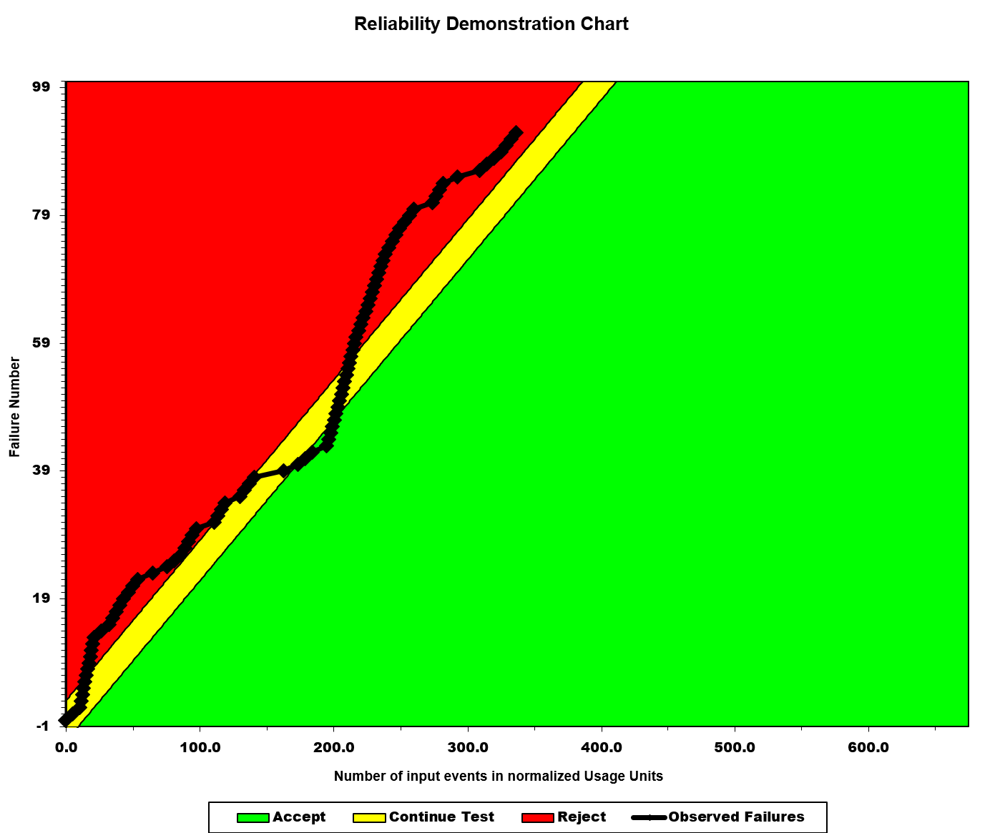

**1/2 $\times$ MTTFmin:** Conversely, we also experiment with half of the minimum MTTF. Dividing the MTTF by 2 indicates that the software system or component is expected to fail more frequently compared to its previous MTTF. We take half of the minimum MTTF $0.046 \div 2 = 0.023$, yielding $FIO = 1/0.023 = 43.47$. Normalizing this into fractions, give us 4347 failures per 100 intervals, or similarly around 1347 failures in 31 intervals. We plot this on the RDC chart. In this setup, the system stays in the accept region forever as it is expected given the reduction in MTTF.

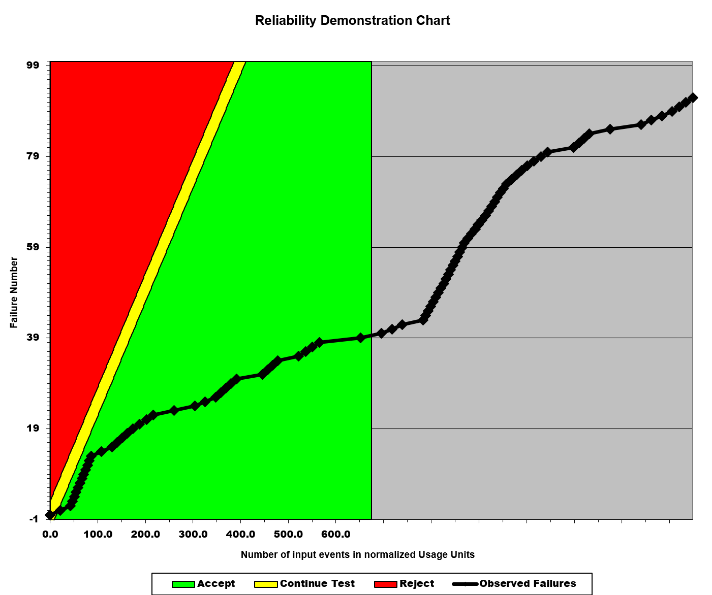

### 3.5 Advantages and disadvantages of Reliability Demonstration Chart

**Advantages**
1. **Graphical decision-making support:** They provide decision-makers with valuable insights into the reliability of a product or system without needing for in-depth understanding of the actual process, helping them make informed decisions quickly about product release, maintenance strategies, and warranty policies.
2. **Easy interpretation:** RDCs are easy to understand in determining whether the SUT is acceptable or not, aligning with the risk appetite of both the user and the developer.
3. **Time and cost efficiency:** RDC is time and cost efficient as it requires simple data processing and plotting, reducing the resources needed for reliability assessment. It also requires very few data to operate.

**Disadvantages**
1. **Difficulty in MTTFmin determination:** Finding the minimum MTTF can be challenging and hectic, and if inaccurately assessed, it can invalidate the entire RDC, rendering it meaningless for reliability evaluation. In our case, it was also difficult to manually find the value. Probably, new methods can be introduced to improve the process.
2. **Lack of quantitative precision:** RDC cannot precisely calculate the quantitative value for the reliability (or availability) of the SUT, limiting its ability to provide exact numerical assessments.

3. **Overemphasis on testing:** RDCs may lead to an overemphasis on testing as the primary means of ensuring reliability, potentially neglecting other important factors such as design robustness and quality control processes. In some cases, releasing the product to the market can be of more emphasis than testing so manual decision making is still necessary.

# 4 Comparison of Results
In comparing the results obtained from both RGT and RDC, it is imperative to utilize a consistent benchmark. In this analysis, we use the MTTFmin value derived from the RDC section, which is determined to be 0.046.

According to the RDC assessment, the MTTFmin is established at 0.046. Conversely, the MTTF of the SUT as determined through the Reliability Growth section stands at 0.338. Based on this comparison, the SUT would be deemed acceptable. Notably, the RDC enables a straightforward visualization of when observed failures transition into the reject or accept region, indicating its efficiency in determining the pass/fail status of the SUT.

However, we also believe that both of the techniques have their own use-cases and are useful to different set of concerned parties. For example, it will be easy to use RDC for a person who is involved in sales and need to make a demonstration to the customers. Whereas, RGT can be much more helpful in the project management and it provides in-depth insights to the teams so that they can plan ahead.

In conclusion, the two techniques are used for distinct objectives. While RGT excels in predicting failure trend behaviors and provides in-depth analytics, RDC specializes in facilitating decision-making regarding the how many testing may be needed or whether it is enough, taking into account various risk factors.

# 5 Discussion on Similarity and Differences of the Two Techniques
In our exploration, we noticed a few similarities and dissimilarities of RGT and RDC. Some of them are listed here:

**Similarities**
1. **Reliability assessment:** Both RDC and RGT are techniques used for assessing the reliability of systems or products over time. They rely on failure rate or MTTF values.
2. **Data utilization:** Both methods rely on the utilization of failure data obtained from testing or operational use of the system.
3. **Continuous monitoring:** Both approaches involve continuous monitoring of reliability metrics to track the performance of the SUT over time. Additionally, both of the approaches contribute to risk mitigation by identifying potential reliability issues early in the development or operational phase.

**Dissimilarities**
1. **Purpose:** RDC primarily focuses on determining whether the SUT meets predefined reliability targets and when testing can be stopped, while RGT works towards predicting and improving the future reliability of the SUT.
2. **Methodology:** From our experience, the main difference between them is how they operate. RDC relies on statistical analysis of reliability data to construct graphical representations for decision-making, whereas RGT employs different models and algorithms to analyze failure data and predict future reliability growth.
3. **Timing of analysis and the way it is done:** RDC analysis is typically conducted at the end of testing, while RGT analysis is ongoing throughout the development process, with periodic assessments to evaluate reliability growth. On the other hand, RGT involves making predictions solely based on the available failure data and the chosen model, while RDC assesses the acceptability of the SUT according to its risk profile.
# 6 Division of team effort
For this lab, we initially divided a few tasks among the members of the team. Based on the outcome of the individual tasks, seperate group meetings were held to compile the final report. The following table distributes tha tasks between the members of the team.
|Member|Task|
|----|---|
|Afif and Sayan|Assessment Using Reliability Growth Testing (RGT)|
|Abhi, Sutirtha and Moshfiq|Assessment using Reliability Demonstration Chart (RDC)|
|Afif|Exploring C-SFRAT and SFRAT/srt.core using Docker, Writing Python scripts for chart and dataset generation|
|Sayan|Exploring SRTAT and CASRE|
|Abhi and Sutirtha| Using RDC for updated failure dataset|
|Moshfiq|Assessing similarities and dissimalirities of the approaches|

# 7 Difficulties encountered, challenges overcome, and lessons learned
### Difficulties and how we dealt with them
1. We faced too many challenges to complete the assigned tasks. The major problem was to find and run the appropriate tool to complete the assignment. None of the tool had the functionalities to support all the tasks. So, we had to try all of them for different purpose, it was time consuming.
2. The tools are outdated and does not run properly in modern computing devices. For example, CASRE was developed in 90s and is no longer supported. We tried DOSBOX with Windows 3.1 but it did not work.
3. SFRAT requires R setup. Having no experience with R, it was difficult to setup. Even after setting up, it did not work. Finally, we decided to use C-SFRAT and SFRAT on Docker to accomplish some tasks. We also utilized Python programming language for data manipulation and plotting along with the provided tools.
4. Even though, SRTAT runs, the provided failure data needs to be formatted appropriately to use it. Also, the software becomes impossible to work with on high-resolution screens as it does not resize properly.
5. The RDC spreadsheet does not accept more than 16 data. We had to find out a modified sheet to use all the data we generated.

### Lessons learned
Although this lab was challenging compared to the previous ones because of the provided tools being obsolete and unsupported, the team learned how to use RGT and RDC for proper reliability assessment. In some extent, we also gained the experience of using outdated tools in your systems with tools like DOSBOX. We also had the opportunity to learn how to prepare dataset for such testing and learn the importance of different factors like MTTF values in reliability measurements.
# 8 Comments/feedback
This assignment helped us gaining hands-on experience on different reliability assessments. We think the experience would be useful in our future career aspects. 

The assignment was challenging but rewarding. It pushed us to apply theoretical knowledge in real-world scenarios. However, we believe the experience can be improved exponentially by providing updated tools with proper documentations. This is the only thing we missed in this assignment and the lack of resources in the Internet was also an obstacle.  

Overall, the assignment was a valuable learning direction, but could be improved with more support materials and clearer documentation of the tools provided.