**SENG 637- Dependability and Reliability of Software Systems***

**Lab. Report \#5 – Software Reliability Assessment**

| Group: 16           |
|-------------------------------|
| Sayan                     |   
| Md Afif Al               |   
| Sutirtha                   |   
| Abhijit              |
| Moshfiq-Us-Saleheen  |

# Table of Contents

# Introduction

# 

# Assessment Using Reliability Growth Testing 
### Model comparison 
In this assignment, we used C-SFRAT, SFRAT tools along with Python for reliability growth testing. We also explored str.core on Docker to assess its capability. Our approach to use this tool is followed by a few steps:
1. Run C-SFRAT.
2. Load the provided failure data.
3. Run estimation for all the available model and covariate combinations. C-SFRAT provides the following hazard functions or models.
    - IFR Salvia & Bollinger
    - IFR genralized Salvia & Bollinger
    - S Distribution
    - Discrete Weibull (Order 2, Type III)
    - Geometric
    - Negative Binomial (Order 2)
    - Truncated Logistic

    The covariates are E, F, C, and a combination of (E, F), (E, C), (F, C), and (E, F, C)
4. Compare the model results by different metrics like Akaike Information Criterion (AIC), Bayesian Information Criterion (BIC), etc.
5. Choose the top 2 best performing models for further analysis.

The initial outcome after running all the models and covariate combinations look like below:
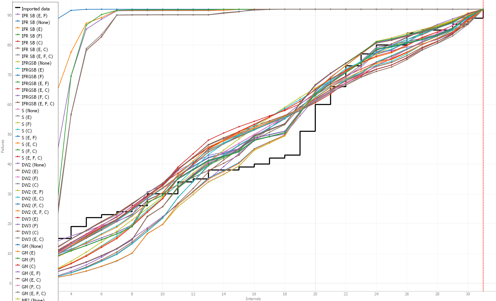
For comparison of the models, we simply sort by the different metric columns provided by the C-SFRAT tool. As defined in our comparison approach above, we choose the best models based on their AIC and BIC values. Both of these metrics are statistical measures used for model selection. 

**AIC**: AIC is a measure of the relative quality of a statistical model for a given set of data. It takes into account both the goodness of fit of the model and the complexity of the model (number of parameters). The lower the AIC value, the better the model is considered to be. In this report, the best AIC score of 122.199 is attained by the Discrete Weibull (Type III) model with covariate (F) and followed by a score of 125.323 gained by the Geometric model with covariate (F).

**BIC**: BIC is similar to AIC but penalizes model complexity more strongly. It tends to select simpler models than AIC when there is a trade-off between goodness of fit and model complexity. Similar to AIC, lower BIC values indicate better-fitting models. In this report, the best BIC score of 127.935 is attained by the Discrete Weibull (Type III) model with covariate (F) and followed by a score of 129.625 gained by the Geometric model with covariate (F).

We report the top 2 models and covariate combinations in the following table. The full results can be found in the [model_results.csv](results/model_results.csv) file.

| Model Name | Covariates | Log-Likelihood | AIC | BIC | SSE | PSSE | Critic (Mean) | Critic (Median) |
|------------|------------|----------------|-----|-----|-----|------|----------------|-----------------|
| **DW3**        | F              | -57.09962860281749 | 122.19925720563498 | 127.93520602357556 | 528.0457018475142 | 16.021015042563807 | 1.0 | 1.0 |
| **GM**         | F              | -59.66172245742845 | 125.3234449148569 | 129.62540652831234 | 759.6549462658442 | 87.9032532380169 | 0.9987877941564863 | 0.999286826565977 |

### Trend analysis
We applied laplace test analysis to find out the most effective subset for prediction. We utilized both SFRAT tool and wrote our own python [script](scripts/laplace.py) for the analysis. The result is in the following figure:
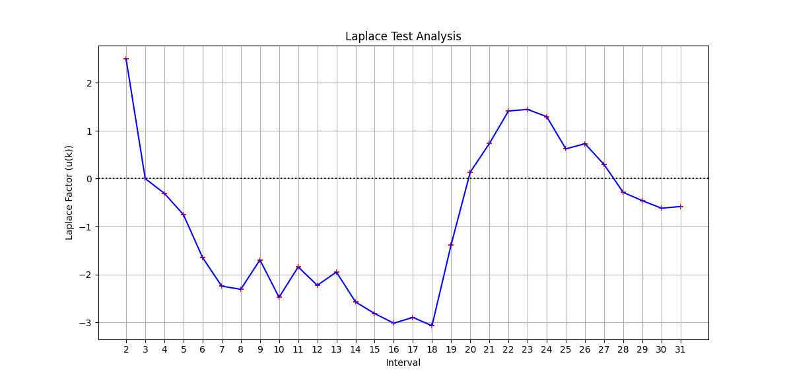 After excluding the first failure, it is evident from the figure that reliability improves from 2nd to 18th interval and then again decreases from 19th to 23rd interval. Generally, a laplace factor ranging between -2 <= _u(k)_ <= 2 indicates stable reliability. Hence, we choose, a range of 0 to 21 to provide our models sufficient data points to get a better insight on the failure data. It turns out using the subset of first 21 data points out of all with the covariate F as 20 efforts per interval yields a very good performance compared to the other combination. One possible reason could be the sharp increase of the number of failures (increased by almost 10) on 20th interval followed by a similar large step in the 19th interval. This essentially means, if we leave out this points from our subset, the model is missing an important pattern while including these two intervals provide a better insights of the data to the models. The plots provided in the following section a better demonstration of this drastic change in the number of failures.

### Running average of failures over time
We also investigate the running average of failure of the SUT by using SFRAT. It is a calculation to analyze data points by creating a series of averages of different selections of the full data set. It helps to smooth out sudden fluctuations in time-series data and provides a better insights on the trend. Typically, if the trend is upwards then the errors or failures are rising and if it is downwards, number of failures is decreasing.
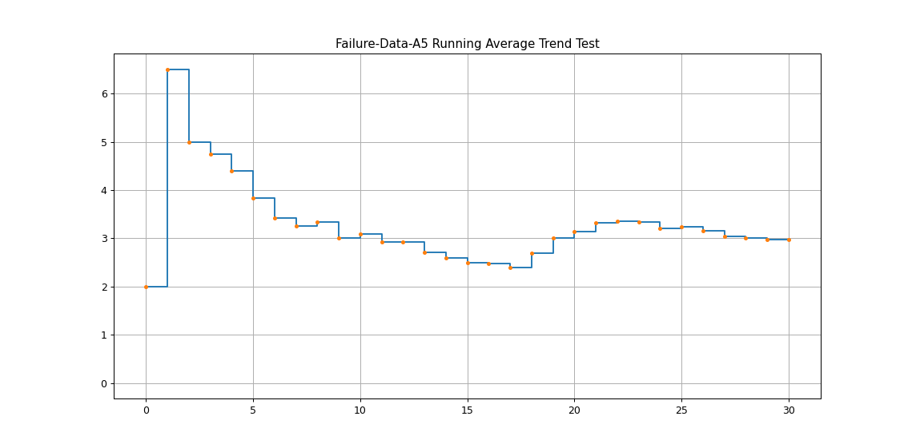
### Plots for failure rate and reliability of the SUT for the test data
For a better comparison, we show both predictions using a subset of all data and predictions using only first 21 data. The interval to failure plot of the two selected models is provided below:
Figure A: Interval to failure plot using all data.
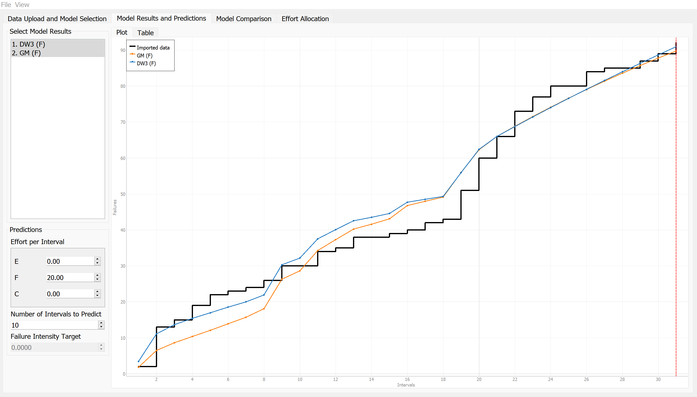
Figure B: Interval to failure plot using subset of 21
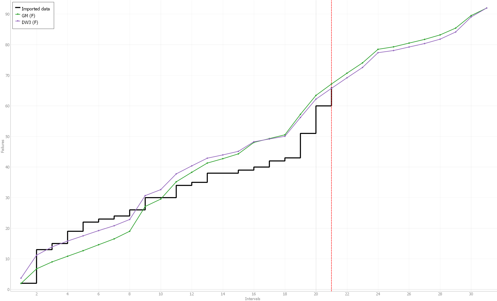

Now we report the failure intensity predictions using all data and using the subset of first 21 data points.

Figure A: Failure intensity plot using all data.
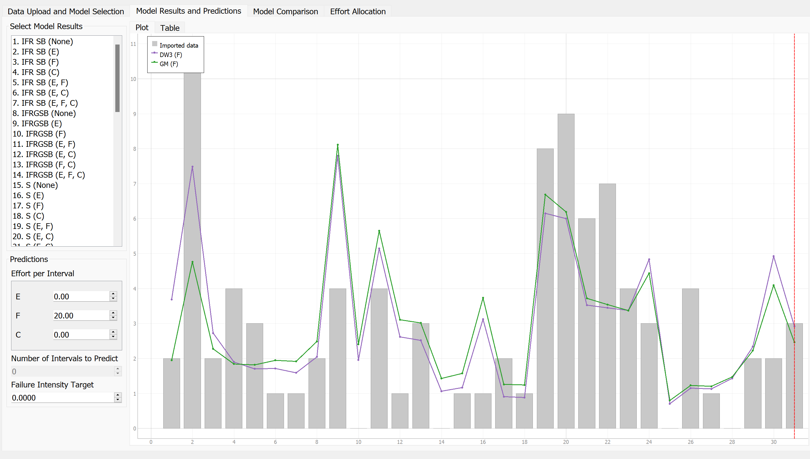
Figure B: Failure intensity plot using subset of 21
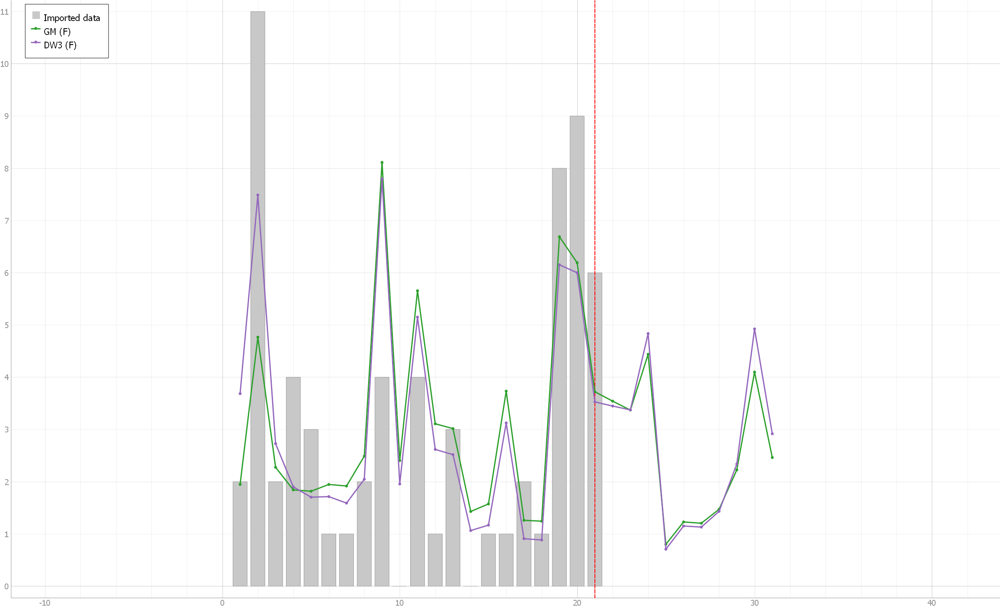

The plots provide us an important insights about our original data amd the prediction of the models.

We get the cumulative failure for both DW3 and GM from this table by summing the respective columns.
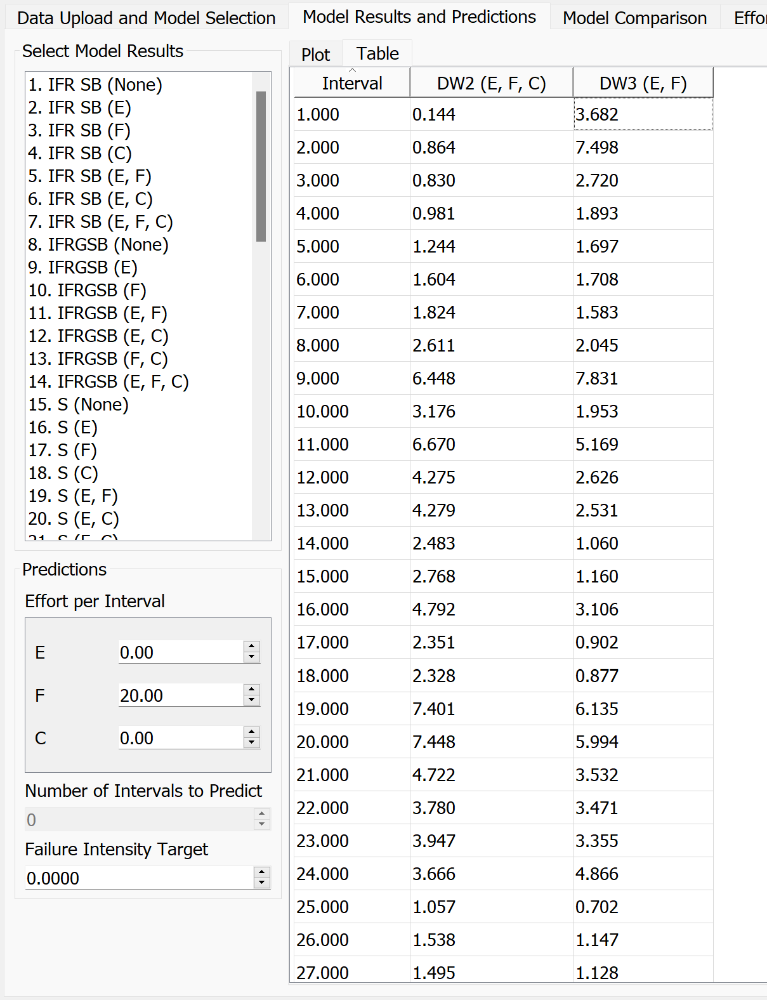

On the 31st interval the cumulative failure for the predictios are:

**DW3 = 91**

**GM = 90**

We calculate the failure rate and mean time to failure (MTTF) for both the original data and the predications in the following table:

| Data         | Failure Rate (Failure/Interval) | MTTF (intervals) |
|-----------------|---------------------------|------------------|
| Provided data      | 92/31 = 2.967              | 1/2.96 = 0.338   |
| DW3 (F) Prediction  | 91/31 = 2.935              | 1/2.94 = 0.340   |
| GM (F) Prediction   | 90/31 = 2.903              | 1/2.90 = 0.345   |

The table provides the results of our models compared to the provided failure data. It seems that by using the subset of first 21 data to predict the next 10 intervals (up to 31st interval), the failure rate and MTTF is almost similar to the original failure data.

### Discussion on decision making given a target failure rate
Based on the results from the previous table, we can use this information to make decisions given a target failure rate. Typically, the concerned software companies/businesses will have their acceptable target failure rate or MTTF.

Let's consider 2 examples with different failure rates.

**Example with an Acceptable Failure Rate of 2:**
If the business considers an acceptable failure rate to be 2 Failures/Interval, then at the 31st interval, this system would be unacceptable because the raw data shows 2.96 failures per interval.

**Example with an Acceptable Failure Rate of 3:**
If the business sets an acceptable failure rate at 3 Failures/Interval, then the system would be acceptable at the 31st interval based on raw data (2.96 failures per interval). However, using the DW or GM model, we can estimate when the failure rate might exceed 3 in the future.

### Discussion on the advantages and disadvantages of reliability growth analysis
**Advantages**

1. **Predictive Capability:** Reliability Growth Testing (RGT) allows users to predict the failure behavior using a set of predefined models. This predictive capability enables proactive identification and mitigation of potential reliability issues.

2. **Model Comparison:** By utilizing Akaike Information Criterion (AIC) and Bayesian Information Criterion (BIC), it becomes easy to compare which models best fit the data. This facilitates informed decision-making regarding model selection and optimization.

3. **Reduces Downtime:** Increased reliability means fewer system failures, resulting in reduced downtime for users and businesses, which can be critical in large-scale systems or businesses.

**Disadvantages**

1. **Dependency on Data Subset:** Predictions generated by RGT are dependent on the subset of data (or ranges) used for the prediction. If the subset contains distortions or outliers, the predictions may not accurately reflect the system's true reliability behavior.

2. **Dependency on Model Selection:** The accuracy of predictions is heavily dependent on the model used. If the selected model is not appropriate for the data or fails to capture the underlying reliability patterns, the predictions may lack accuracy and reliability. Therefore, careful consideration and validation of the chosen model are crucial for obtaining meaningful results from RGT.

3. **False Sense of Security:** Relying solely on reliability growth testing may give a false sense of security, as it cannot guarantee that all reliability issues have been addressed, and unforeseen failures may still occur in real-world usage.

# Assessment Using Reliability Demonstration Chart 
We utilized the RDC-11 spreadsheet to demonstrate Reliablity Demonstration Chart. However, the spreadsheet only accepts failures per interval. Hence, we modified the provided failure data uniformly in each interval to use it with the spreadsheet. Additionally, the spreadsheet only supports 16 data points. Hence, we had to look for a modified version of the RDC spreadsheet that could accommodate all the 92 data points that we get after preparing our failure dataset. 

### Dataset preparation
Let's assume we have $FC = 2$ on $T = 1$. Hence, we distribute intervals uniformly by converting it to:

|Cumulative Failure Count|Time Between Failure|Cumulative Time|
|---|---|---|
|1|0.5|0.5|
|2|0.5|1.0|

The logic is implemented in this Python [script](scripts/RDC.py) and the new generated dataset can be found [here](failure-data-a5/failure-data-rdc.csv).

In the following table, we show the first 5 and last 3 rows from the table to provide a better understanding of our generated data:
| Cumulative Failure Count | Time Between Failure | Cumulative Time |
|--------------------------|----------------------|-----------------|
| 1                        | 0.5000               | 0.5000          |
| 2                        | 0.5000               | 1.0000          |
| 3                        | 0.0909               | 1.0909          |
| 4                        | 0.0909               | 1.1818          |
| 5                        | 0.0909               | 1.2727          |
|...                       |...                   |...              |
|90                        |0.3333                |26.3333          |
91|0.3333|26.6667|
92|0.3333|27.0000|

### RDC plot generation

To generate the RDC we use the default risk parameters:
|Risk Parameter|Value|
|---|---|
|Discrimination Ratio ($\gamma$)| 2|
|Developer's Risk ($\alpha$)|0.1|
|User's Risk ($\beta$)|0.1|

1. **Default MTTF:** We first plot the RDC graph using the calculated MTTF of the SUT, where we have:

    $FIO = 92 failures/31 intervals = 2.97$ and $MTTF = 1/FIO = 1/2.97 = 0.337$
    
    It turns out, with this setup, the system immediately goes into the reject region.
    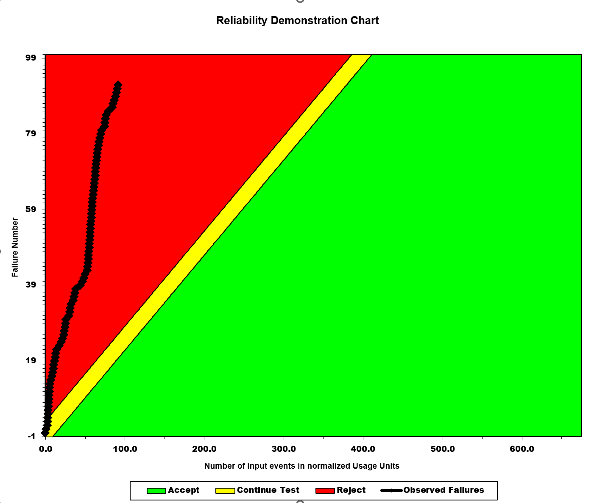

2. **MTTFmin</min>:** In the second setup, we attempt to find the MTTFmin where the system is deemed to be acceptable. We find this by brute-force approach of changing the FIO until it becomes barely acceptable. By this, we mean that the system may probably touch the reject line but will never enter the reject region. We find the MTTFmin when $FIO = 670 failurs/31 intervals = 21.613$ and $MTTF = 1/21.613 = 0.046$. Similar behaviour of the RDC chart was observed when the failure rates were between 670 - 675.
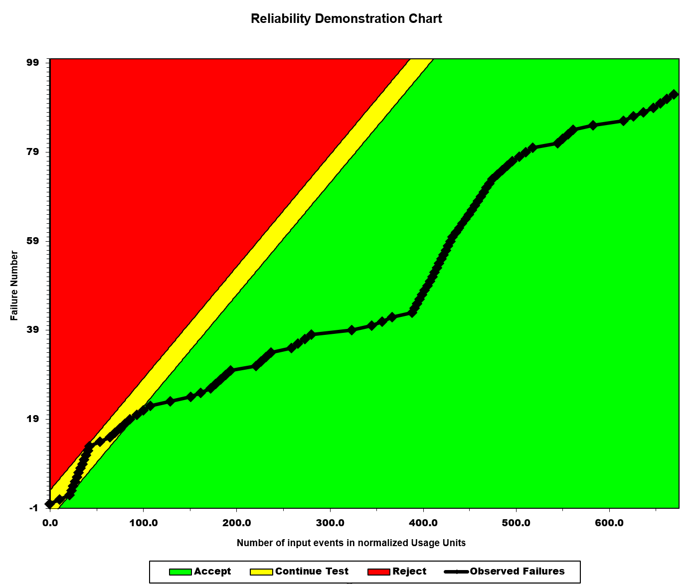

3. **2 $\times$ MTTFmin**: After finding the MTTFmin, as per the requirements of this assignment, we double the value of MTTF and experiment with it. Doubling the MTTF implies that the software system or component is expected to operate reliably for a longer period before encountering a failure. We double the MTTF to $0.046 \times 2 = 0.092$, yielding $FIO = 1/0.092 = 10.87$. Normalizing this into fractions, give us 1087 failures per 100 intervals, or similarly around 337 failures in 31 intervals. We plot this on the RDC chart. In this setup, the system goes to the reject region quite fast and fluctuates between accept and reject region.

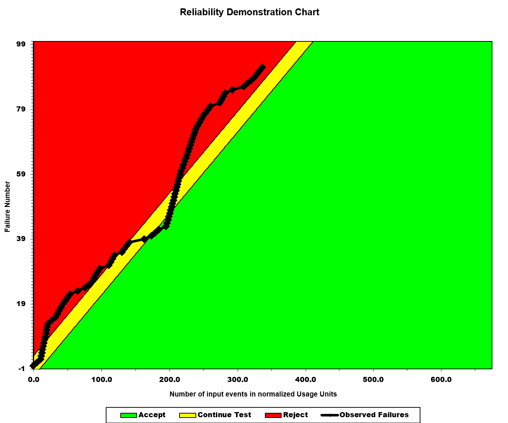

3. **1/2 $\times$ MTTFmin**: Conversely, we also experiment with half of the minimum MTTF. Dividing the MTTF by 2 indicates that the software system or component is expected to fail more frequently compared to its previous MTTF. We take half of the minimum MTTF $0.046 \div 2 = 0.023$, yielding $FIO = 1/0.023 = 43.47$. Normalizing this into fractions, give us 4347 failures per 100 intervals, or similarly around 1347 failures in 31 intervals. We plot this on the RDC chart. In this setup, the system stays in the accept region forever as it is expected given the reduction in MTTF.

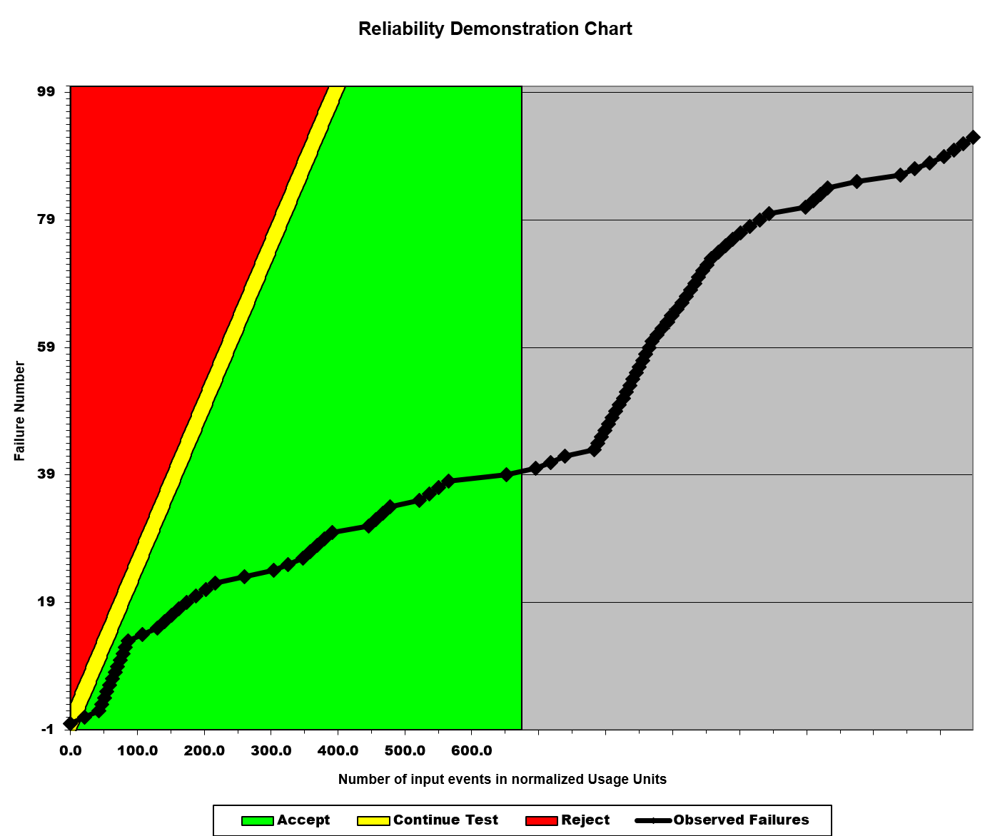

# Comparison of Results

# Discussion on Similarity and Differences of the Two Techniques

# How the team work/effort was divided and managed

# 

# Difficulties encountered, challenges overcome, and lessons learned

# Comments/feedback on the lab itself
